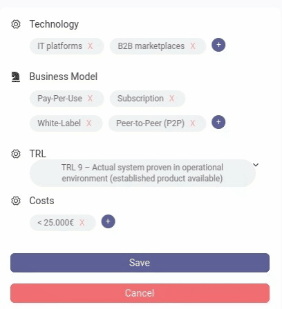

# Book Store App 

This project is building a an application that fetches a product from backend API with whilte-Labeling configuration. It is a reponsive app that views differnet attributes of a product such as picture, userInfo, mainInfo, video, details, company, etc. 

### Desktop view

### Mobile view

### Product details

The product details shows the list of technologies, business Models, and also trl and Costs. All the fields are populated by api data. Once the user clicks the edit button, the edit state of the component will be activated and the contentEditable fields (all the list elements) become editable. Users can edit, delete and also add list items. 

The trl has select options in which the options are populated by the `baseApi/trls/` request. There is a dropdown to select from the trls. When the user clicks the save button the updated fields of the product details will be assigned as payload for the put api request. 

### Rich text editor
The rich text editor allows users to write text, format it and save it. Bold, italics, indent, unindent, ordered list, unordered list, left, center, right, justify, hyperlink, undo, redo are the formatting functionalities. 

In addition there is a wordCount which counts in real time and the editor will not let  users write once the max word limit is reached. Also the word count text turns to red. 

The editor descroption and title are populated from data fetched from backend api. Once the user completes the writing and clicks the save button a put request will be sent to the backend api to save the changes to database. 

Built with React Quill library. 

### White-labeling

The api has a configuration endpoint for white labeling. Based on the configuration for a specific APP_ID which is saved in the .env of the app, user has mainColor on the header background, logo and whether userSection will be dispayed or not. 

### Api 
    - baseApi: `https://api-test.innoloft.com`
    - Product
        - fetch: `GET /product/6781/`
        - save: `PUT /product/6781/`
    - TRL List
        - `GET /trl/`
    - APP Configuration
        - `GET /configuration/:appId/`

## Built With

- `Node.js` | `React` | `React-DOM` | `React-Create-App` 
- `Redux` | `npm` | `sass` | `ES6` | `GoogleMapReact` | `tailwindCSS`

# Getting Started
This project was bootstrapped with [Create React App](https://github.com/facebook/create-react-app).

## SetUp 
- Clone the repository 
`https://github.com/henatan99/innoloft-frontend-app.git`

- cd to the project directory 
`innoloft-frontend-app`

- Install dependancies 
`npm install`

- Add `.env` file inside the root folder and add APP_ID=yourAppId, `yourAppId` must be either 1 or 2.

## Available Scripts for App Usage

In the project directory, you can run:

### `npm start`

Runs the app in the development mode.\
Open [http://localhost:3000](http://localhost:3000) to view it in the browser.

The page will reload if you make edits.\
You will also see any lint errors in the console.

### `npm test`

Launches the test runner in the interactive watch mode.\
See the section about [running tests](https://facebook.github.io/create-react-app/docs/running-tests) for more information.

### `npm run build`

Builds the app for production to the `build` folder.\
It correctly bundles React in production mode and optimizes the build for the best performance.

The build is minified and the filenames include the hashes.\
Your app is ready to be deployed!

### Prerequisites

- Node.JS

## Authors

👤 **Henok Mossissa**

- GitHub: [@henatan99](https://github.com/henatan99)
- Twitter: [@henatan99](https://twitter.com/henatan99)
- LinkedIn: [Henok Mossissa](https://www.linkedin.com/in/henok-mekonnen-2a251613/)

## :handshake: Contributing

Contributions, issues, and feature requests are welcome!

## Show your support

Give a :star:️ if you like this project!

## Acknowledgment 

- Facebook team who created creat-react-app API
- [Innoloft](https://www.linkedin.com/company/innoloft/)

## :memo: License

This project is [MIT](./LICENSE) licensed.